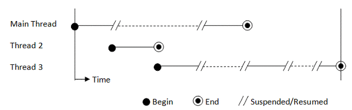
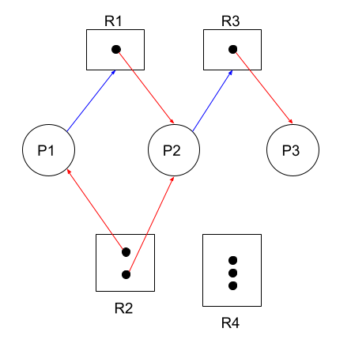

## 1. 동기화 문제

### 1.1. 동기화

#### 1.1.1 멀티 스레드 동작 환경

#### 1.1.2. 동기화

> 임계 구역에서 스레드들이 순서에 따라 공유 자원을 사용하게 하는 것

### 1.2. 해결 방법

#### 1.2.1. Locking

> 임계 구역에 진입하는 프로세스는 Lock을 획득하고, 빠져나올 때 Lock을 반납한다

- Lock을 얻기 위해서 무한 루프를 돌면서 계속 CPU를 점유한다
- 대기 시간이 짧다면 컨텍스트 스위칭 비용이 발생하지 않는다

#### 1.2.2. Semaphores

##### 1.2.2.1. 이진 세마포(뮤텍스)

> 공유 자원을 사용하는 프로세스는 Lock을 획득하고, 공유 자원 사용을 그만둘 때 Lock을 반납한다

- 무한 루프를 돌지 않고 컨텍스트 스위칭를 통해 Sleep, Wakeup 상태 전환을 해서 CPU를 점유하지 않는다
- 대기 시간이 짧다면 컨텍스트 스위칭 비용이 더 클 수 있다

##### 1.2.2.2. 카운팅 세마포

> 세마포어 변수를 올리고 내리는 방식으로 공유 자원 접근을 제어한다

- 세마포어 변수가 0 이하가 되면 Block되고 양수가 될 때까지 바쁜 대기를 한다

## 2. 교착 상태(Dead Lock)

> 두 개 이상의 작업이 서로 상대방의 작업이 끝나는 것을 기다리고 있는 상태

### 2.1. 교착 상태의 발생조건

1. 상호 배제 : 프로세스들이 필요로 하는 자원에 대해 배타적이다
   - 자원을 동시에 사용할 수 없는 경우
2. 점유 대기 : 프로세스가 이미 자원을 갖고 있는 상태에서 다른 자원을 할당받기를 기다린다
3. 선점 불가 : 프로세스가 어떤 자원의 사용을 끝내기 전까지 해당 자원을 빼앗을 수 없다
4. 순환 대기 : 각 프로세스는 순환적으로 다음 프로세스가 필요로 하는 자원을 갖고 있다
   - A -> B -> C -> A 와 같은 상황

### 2.2. 교착 상태의 해결 방법

#### 2.2.1. 교착 상태의 예방

1. 상호 배제 조건의 제거 : 공유 자원을 여러 스레드가 사용할 수 있게 한다
2. 점유 대기 조건의 제거 : 프로세스가 수행되는 데에 필요한 공유 자원을 한번에 할당받을 때까지 작업을 보류하도록 한다
3. 비선점 조건의 제거 : 우선 순위 부여 등을 통해 자원을 선점할 수 있는 조건을 준다
4. 순환 대기 조건의 제거 : 자원 유형에 따라 순서를 부여한다

#### 2.2.2. 교착 상태의 회피

> 순환 대기가 발생하지 않도록 자원 할당 상태를 검사

1. 자원 할당 그래프 알고리즘
2. 은행원 알고리즘

##### 2.2.2.1. 자원 할당 그래프

> 프로세스가 자원을 요청하고 자원이 프로세스에게 할당되는 방향성을 가진 그래프

- P : 프로세스, R : 자원타입, 암점 : 할당할 수 있는 자원

#### 2.2.3. 교착 상태의 무시

> 데드락의 발생 확률이 비교적 낮다면 조치를 취하지 않는다

#### 2.2.4. 교착 상태의 발견

> 탐지 알고리즘으로 데드락 발생을 체크하는 방식

### 2.3. 교착 상태에서의 회복

1. 프로세스를 1개 이상 중단한다
   - 교착상태에 빠진 모든 프로세스를 중지한다
   - 프로세스를 하나씩 중단하면서 데드락을 탐지한다
2. 프로세스에게 할당된 자원을 선점해서 데드락이 해결될 때까지 다른 프로세스에게 할당한다

