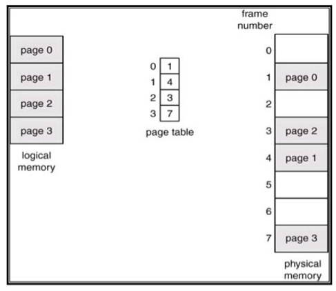

## 1. 페이징 기법

### 1.1. 페이징 기법

> 메인 메모리에서 사용하기 위해 보조 기억 장치로부터 데이터를 저장하고 검색하는 메모리 관리 기법

- 가상메모리를 페이지(모두 같은 크기의 블록)으로 편성하여 운용하는 기법
- 주소 공간을 페이지 단위로 나누고 실제기억공간은 페이지 크기와 같은 프레임으로 나누어 사용
- 주소 공간과 실제 저장 공간을 매핑해서 외부단편화를 막는다

  - 프로세스를 그대로 넣으면 외부단편화가 발생한다
  - 내부단편화가 발생할 수 있다 -> 외부단편화에 비해서는 매우 작다

### 1.2. Page Table

- 실제 저장공간에 적재된 데이터가 연속적이지 않다. 이를 선형적으로 수행해주기 위해 page table을 둔다

#### 1.2.1. Page Offset

> 페이징 기법이 적용된 시스템에서 가상주소는 순서쌍 (p, d)

- 논리 주소를 자른 페이지의 번호 p
- 페이지를 4kb로 잘랐다고 했을 때, 4kb = 2^12 이므로 페이지 하나당 12bits
  - 페이지 내의 주소(bit), 오프셋 d

